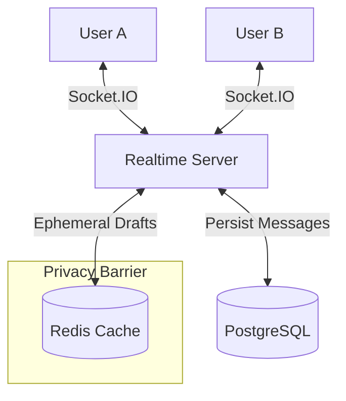

# ⚡ Live Draft Chat

> **Real-time messaging with a twist:** See what they are typing, *as* they type.


**Live Draft Chat** is a next-generation 1-to-1 messaging application that introduces **Consent-Based Telepathy**. While traditional chat apps show "Typing...", this application allows users to opt-in to share their *actual keystrokes* in real-time, creating a more intimate and synchronous conversation experience.

---

## 🚀 Live Demo

| Component | Status | URL |
|-----------|--------|-----|
| **Web App** | 🟢 Online | [https://realtime-draft-messenger.vercel.app](https://realtime-draft-messenger.vercel.app) |
| **Server** | 🟢 Online | [https://realtime-draft-messenger.onrender.com](https://realtime-draft-messenger.onrender.com) |

> *Note: Open the web app in two different browsers (or an Incognito window) to test the realtime features yourself!*

---

## ✨ Key Features

### 1. 🔮 Live Drafts (The "Killer Feature")
-   **Real-time Keystroke Sync**: Drafts are synchronized via WebSocket + Redis as you type.
-   **Privacy-First**: This feature is **OFF** by default. Both users must explicitly click the "Eye" icon to enable it.
-   **Ephemeral Storage**: Drafts are stored in Redis with a short TTL (Time-To-Live). They are **never** saved to the permanent database.

### 2. ⚡ High-Performance Realtime
-   **Socket.IO Architecture**: Custom WebSocket server handling room-based broadcasting.
-   **Optimistic UI**: Messages appear instantly on the sender's screen, even on slow networks.
-   **Debounce Optimization**: Smart network throttling ensures typing is smooth without flooding the server.

### 3. 🛡️ Enterprise-Grade Foundation
-   **Authentication**: Secure login via NextAuth.js (JWT strategies).
-   **Type Safety**: End-to-end TypeScript (Frontend & Backend).
-   **Monorepo**: Built with TurboRepo for scalable package management.

---

## 🛠️ Tech Stack

### Frontend
-   **Framework**: Next.js 14 (App Router)
-   **Language**: TypeScript
-   **Styling**: Tailwind CSS + Shadcn UI
-   **State**: React Hooks + Socket.IO Client

### Backend
-   **Runtime**: Node.js + Express
-   **Realtime**: Socket.IO
-   **Caching**: Redis (Upstash) - *For ephemeral drafts*
-   **Database**: PostgreSQL (Supabase) - *For persistent messages*
-   **ORM**: Prisma

### DevOps
-   **Build System**: TurboRepo
-   **Deployment**: Vercel (Client) + Render (Server)
-   **Containerization**: Docker (Development)

---

## 🧩 Architecture



---

## 🏃‍♂️ Getting Started (Local Development)

Want to run this locally? Follow these steps:

### 1. Clone & Install
```bash
git clone https://github.com/ali-novruz/realtime-draft-messenger.git
cd realtime-draft-messenger
pnpm install
```

### 2. Environment Setup
Create a `.env` file in `apps/web` and `apps/server`:
```env
# Database
DATABASE_URL="postgresql://..."
DIRECT_URL="postgresql://..."

# Redis
REDIS_URL="redis://..."

# Auth
NEXTAUTH_SECRET="your-secret"
```

### 3. Run It
```bash
# Start the development server (runs both Client and API)
pnpm dev
```

Visit `http://localhost:3000` to see the app.

---

## 📜 License

This project is open source and available under the [MIT License](LICENSE).

---

<p align="center">
  Built with ❤️ by [Ali Novruz](https://github.com/ali-novruz)
</p>
